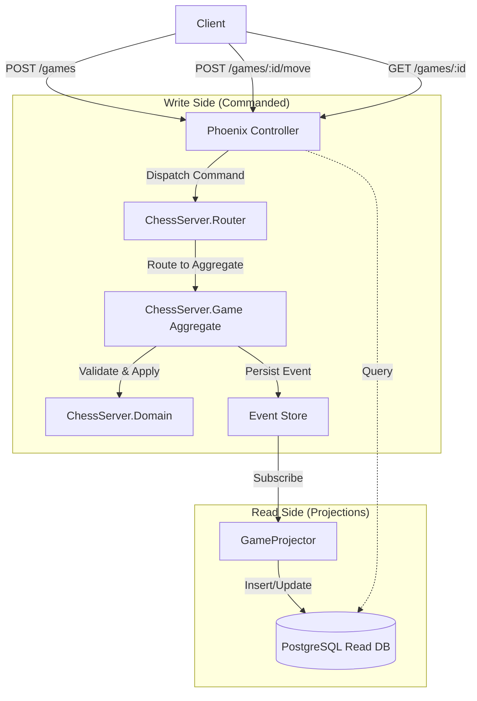

# JULES_ARCHITECTURAL_DIGEST

## Project Overview
This project is a **Chess Server** built with **Elixir** and **Phoenix**, implementing a **CQRS (Command Query Responsibility Segregation)** and **Event Sourcing** architecture. It allows users to create chess games and make moves via a JSON API. The state of the game is persisted as a stream of events (`Started`, `Progressed`, `Finished`) in an Event Store, while a read-optimized projection (PostgreSQL table) is maintained for querying game state.

## Tech Stack & Versions
*   **Language:** Elixir (~> 1.14)
*   **Web Framework:** Phoenix (~> 1.7.0)
*   **Database:** PostgreSQL (via Ecto ~> 3.10)
*   **Event Sourcing/CQRS:**
    *   `commanded` (~> 1.4)
    *   `eventstore` (~> 1.4)
*   **JSON Handling:** Jason
*   **Testing:** ExUnit (built-in)

## Entity Relationship Map

### Write Model (Event Stream)
The source of truth is the Event Stream for the **Game** aggregate.
*   **Aggregate:** `ChessServer.Game` (Identity: `game_id`)
*   **Events:**
    *   `Started`: `game_id`, `white_player`, `black_player`
    *   `Progressed`: `game_id`, `fen`, `turn_color`, `from`, `to`, `promotion`
    *   `Finished`: `game_id`, `reason`, `winner`

### Read Model (Relational Projection)
A projection is maintained in the `games` table for fast reads.
*   **Table:** `games`
    *   `id` (PK, String): Matches `game_id`
    *   `white_player` (String)
    *   `black_player` (String)
    *   `status` (String): e.g., "active", "checkmate"
    *   `turn_color` (String): "white" or "black"
    *   `fen` (String): Forsyth–Edwards Notation of the board
    *   `move_count` (Integer)

## Architecture Diagram

## Critical Paths

### 1. Game Creation
1.  **Request:** `POST /api/games` with player names.
2.  **Controller:** `GameController.create` builds `CreateGame` command and calls `App.dispatch`.
3.  **Command Handling:** `ChessServer.Game` aggregate receives command. If ID is new, it returns `Started` event.
4.  **Event Persistence:** `Started` event is saved to Event Store.
5.  **Projection:** `GameProjector` handles `Started`, inserting a new row into `games` table with initial FEN.
6.  **Response:** Controller returns the game details (assuming eventual consistency caught up).

### 2. Move Execution
1.  **Request:** `POST /api/games/:id/move` with `from`, `to` (algebraic notation).
2.  **Controller:** `GameController.move` builds `MakeMove` command.
3.  **Command Handling:** `ChessServer.Game` aggregate rehydrates from past events.
4.  **Domain Logic:** `ChessServer.Domain.GameState.make_move` validates the move (pseudo-legal, check, turn).
5.  **Event Generation:**
    *   If valid: Returns `Progressed` (and optionally `Finished`) events.
    *   If invalid: Returns error.
6.  **Projection:** `GameProjector` updates `games` table with new FEN, turn, and status.

## Style Guide
*   **Modules:** Nested under `ChessServer` (Core) and `ChessServerWeb` (Web).
*   **CQRS:** Strict separation.
    *   **Commands:** Structs in `Domain.Commands`.
    *   **Events:** Structs in `Game` (e.g., `ChessServer.Game.Started`).
    *   **Aggregates:** Handle business logic and state reconstruction.
*   **Domain Logic:** Pure functional core in `ChessServer.Domain`.
*   **Naming:** Snake_case for variables/functions, PascalCase for modules.
*   **Error Handling:** `{:ok, result}` | `{:error, reason}` tuples.

## Operational Instructions
*   **Install Dependencies:** `mix deps.get`
*   **Setup Database:** `mix ecto.setup` (This creates DB and runs migrations)
*   **Run Server:** `mix phx.server` (Runs on port 4000)
*   **Run Tests:** `mix test`

## Technical Debt / Observations
*   **Eventual Consistency:** The `GameController` dispatches a command and immediately queries the `Repo` for the updated state. In a high-load environment, the projection might not be updated yet, leading to stale data being returned.
*   **Projector Safety:** `GameProjector` uses `Repo.insert!` and `Repo.update!`. If the database is down or constraint violations occur, the projection process will crash (and likely restart/retry endlessly).
*   **Hardcoded FEN:** The initial FEN string is hardcoded in `GameProjector` instead of being derived from a shared constant in `Domain`.
